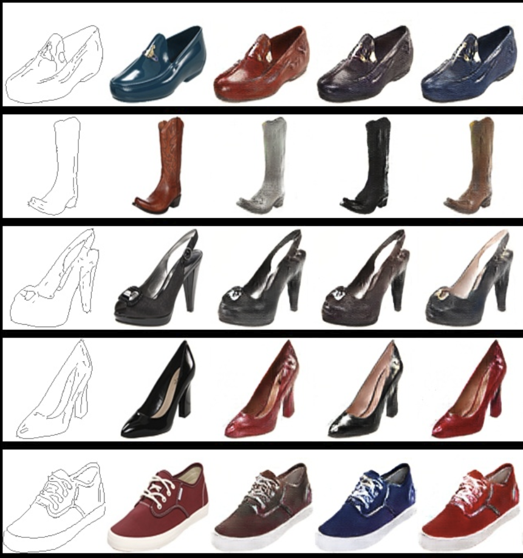
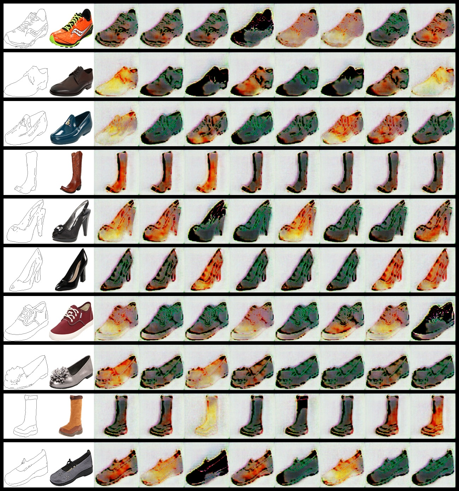
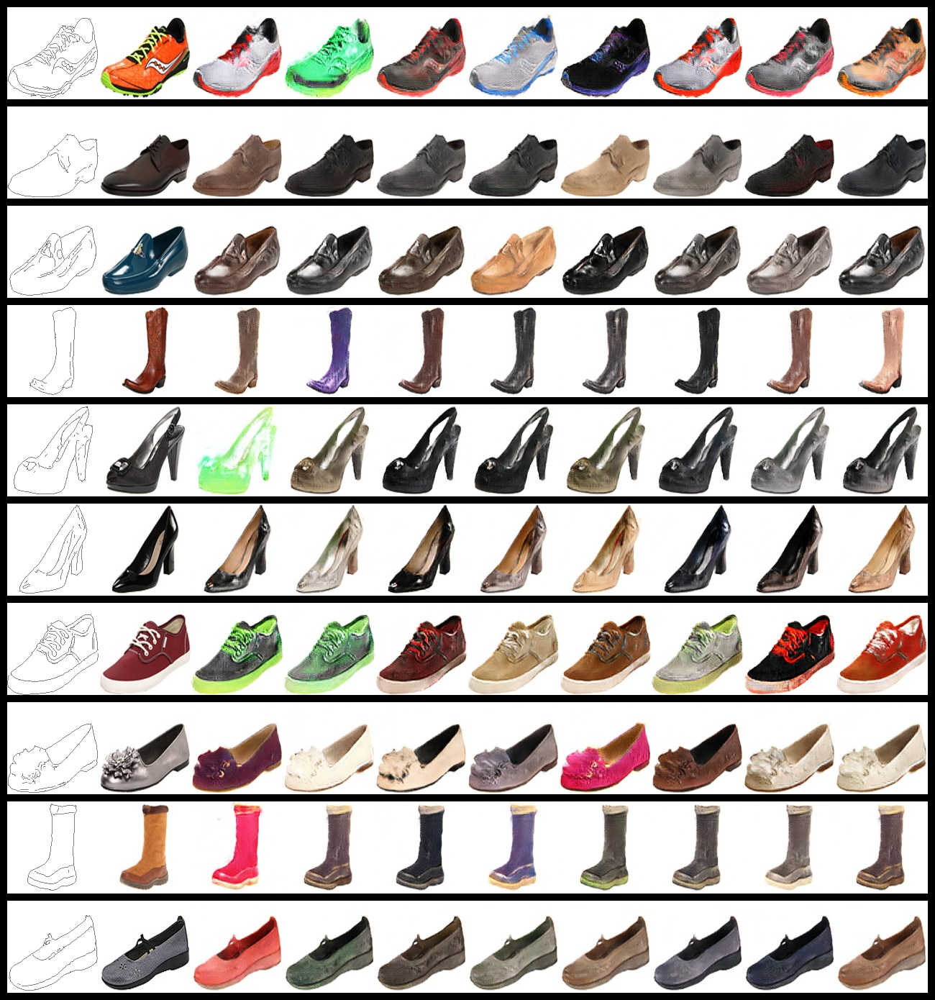
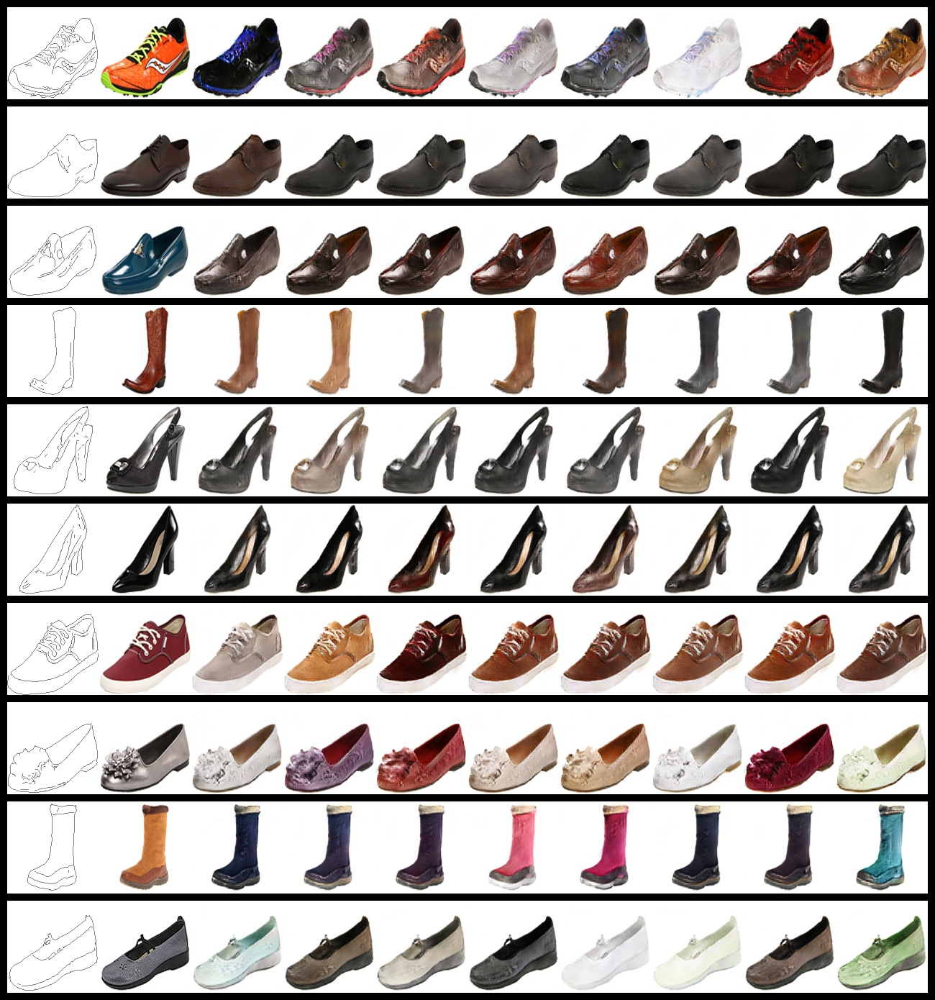

# CYCLE-GAN
Implementation of of the paper Toward Multimodal Image-to-Image Translation

# image to image translation 
<p align="center"> 
  
  <h3 align="center">
    A python script based on bicycle_gan for multimodal image 2 image translation  
  </h3>  
</p>

---
---
# abstract (paper)
Many image-to-image translation problems are ambiguous, as a single input image
may correspond to multiple possible outputs. In this work, we aim to model
a distribution of possible outputs in a conditional generative modeling setting.
The ambiguity of the mapping is distilled in a low-dimensional latent vector,
which can be randomly sampled at test time. A generator learns to map the given
input, combined with this latent code, to the output. We explicitly encourage the
connection between output and the latent code to be invertible. This helps prevent
a many-to-one mapping from the latent code to the output during training, also
known as the problem of mode collapse, and produces more diverse results. We
explore several variants of this approach by employing different training objectives,
network architectures, and methods of injecting the latent code. Our proposed
method encourages bijective consistency between the latent encoding and output
modes. We present a systematic comparison of our method and other variants on
both perceptual realism and diversity.

# contents
* [structure](#structure)
* [results](#results)
* [prerequisites](#prerequisites)
* [installation](#installation)
* [training](#training)
* [prediction](#searching)


# structure
This project is structured in a modular way
It contains the :
* following directories:
    * modelizations
        * definition of generator structure 
        * definition of discriminator structure
    * libraries
    	* group a set of functionalies such as
    	* image procesing 
    	* path manipulation
      * logger   
    * datalib 
        * data_holder   
        * data_loader       
    * static    
        * contains some image, font for readme rendering 
        * can be easily extended by the user 
* following files
        * config.py 
        * README.md 
        * .gitignore
        * requirements.txt 

#results


<p align="center"> 
  
  <h3 align="center">
    generator output epoch N°000 
  </h3>  
</p>

<p align="center"> 
  
  <h3 align="center">
    generator output epoch N°064 
  </h3>  
</p>


<p align="center"> 
  
  <h3 align="center">
    generator output epoch N°128 
  </h3>  
</p>

# prerequisites
* git
* curl
* cmake 
* pkg-config 
* libatlas-base-dev 
* libboost-python-dev 
* libopenblas-dev 
* liblapack-dev
* python3
* python3-venv 
* build-essential 

# installation 
```bash
	git clone https://github.com/Milkymap/BICYCLE-GAN
	cd CYCLE-GAN
	python -m venv env 
	source env/bin/activate
	pip install -r requirements.txt
```


# training

```python
  # set options from config.py
  """
  MODELS_PATH=path_where_the_resnet_model_was_saved
  IMAGES_PATH=path2/Edges2Shoes/train/
  MODELS_NAME=resnet_model_name_18.th
  FAKE_IMAGES_STORAGE=path_to_fake_images_storage
  VALIDATION=path2/Edges2Shoes/val/
  MODELS_DUMP=path_where_the_models_will_be_saved_during_checkpoint

  NOISE_DIM=8
  IMG_WIDTH=128
  IMG_HEIGHT=128

  NB_EPOCHS=256
  BATCH_SIZE=8
  LEARNING_RATE=0.0002
  BETA_1=0.5
  BETA_2=0.999
  SNAPSHOT_INTERVAL=8192
  CHECKPOINT=32

  LAMBDA_KL=0.01
  LAMBDA_PIXEL=10
  LAMBDA_LATENT=0.5

  USE_PRETRAINED=False  
  START_EPOCH=0
  """
  python main.py
``` 
